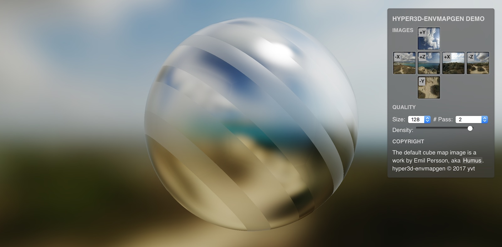

Hyper3D EnvMapGen
=================

Pre-filtered mipmapped radiance environment map generator that runs on WebAssembly. The core functionality is implemented by Rust and is available as a standalone crate.



## Features

- LTASG (linear-time approximate spherical Gaussian) filtering that can be used to approximate the Blinn-Phong NDF for small roughness values.

Possible TODOs:

- More filtering algorithms and techniques
    - GGX + importance sampling
    - GGX + [Fast Filtering of Reflection Probes]
- Linear filtering in LTASG 
    - The currently used nearest neighbor filtering produces a poor result unless the number of passes is set to at least two or three.
    - Investigate the behavior with large σ values

[Fast Filtering of Reflection Probes]: https://dl.acm.org/citation.cfm?id=3071786

## Usage: JavaScript

The following TypeScript code shows the basic usage of `hyper3d-envmapgen`:

(Just remove the type annotations to convert it to JavaScript)

```ts
import { LtasgBlur, ImageFormat } from 'hyper3d-envmapgen';

(async () => {

    // See `ts/ltasgblur.ts` for all options
    const ltasg: LtasgBlur = await LtasgBlur.create({
        // The size of the base mipmap
        imageSize: 128,

        // The σ value (blur size) of each mipmap level. Must be reasonably 
        // smaller than 1.
        mipLevelSigmas: Array.from(
            new Array(8), 
            (_, i) => 0.5 ** (6 - Math.min(4, i))
        ),

        // The number of passes — have an impact on the filtering quality. 
        // You usually specify one of 1, 2, and 3.
        minNumPasses: 2,
    });

    // Construct the mipmap pyramid
    const mipmapLevels = ltasg.process(
        [
            images.positiveX, images.negativeX,
            images.positiveY, images.negativeY,
            images.positiveZ, images.negativeZ,
        ],
        ImageFormat.Srgbx8,
        ImageFormat.Srgbx8,
    ) as Uint8Array[][];

    for (let level = 0; level <= Math.log2(ltasg.size); ++level) {
        for (let i = 0; i < 6; ++i) {
            gl.texImage2D(gl.TEXTURE_CUBE_MAP_POSITIVE_X + k, level,
                gl.SRGB_ALPHA_EXT, ltasg.size >> level, ltasg.size >> level,
                0, gl.SRGB_ALPHA_EXT, gl.UNSIGNED_BYTE,
                level < mipmapLevels.length ? mipmapLevels[level][i] : null);
        }
    }
})();
```

And then in your fragment shader...

```glsl
float blinn_phong_power = 1024.0;
float lod = 6.0 - log2(blinn_phong_power) * 0.5 - 1.0;
vec3 image = textureCubeLodEXT(u_Texture, v_Reflect, lod);
```

## Usage: Rust

This repository provides a crate named `hyperenvmapgen`, which can be found in the directory `rust`.

This crate is never meant to be stablized. Therefore, it is strongly recommended to specify the revision hash as shown below:

```toml
[dependencies]
hyperenvmapgen = { 
    git = "https://github.com/Hyper3D/hyper3d-envmapgen", 
    rev = "INSERT REVISION HASH HERE",
    path = "rust",
}
```

See `rust/examples/blurcubemap.rs` for the usage.

## Building

    # Install the Rust toolchain for WebAssembly compilation
    rustup target add wasm32-unknown-unknown --toolchain nightly
    cargo install --git https://github.com/alexcrichton/wasm-gc 

    # Install necessary packages
    npm install

    # Build the library
    npm run build

    # Build and open the demo
    npm run start:examples
